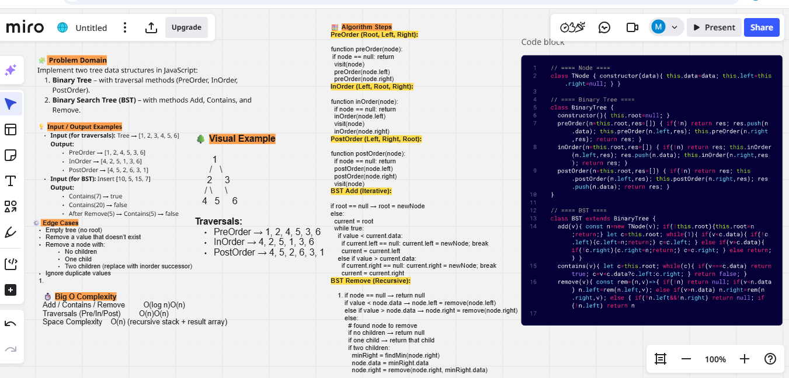
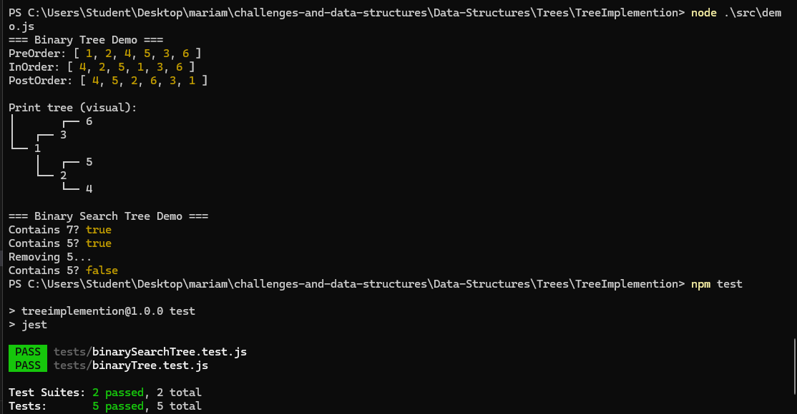

# Tree Implementation 🧠🌳

## Binary Tree & Binary Search Tree

Welcome to this fun and educational challenge! 🎉  
In this project, we implement **Binary Tree** and **Binary Search Tree (BST)** in JavaScript.  
You'll learn how to traverse trees (PreOrder, InOrder, PostOrder), add and remove nodes in a BST, and test everything with **Jest**.  

This repo is perfect for anyone who wants to understand the magic behind tree data structures and see them come alive in the console! 💻✨

## whiteboard

### console-output

