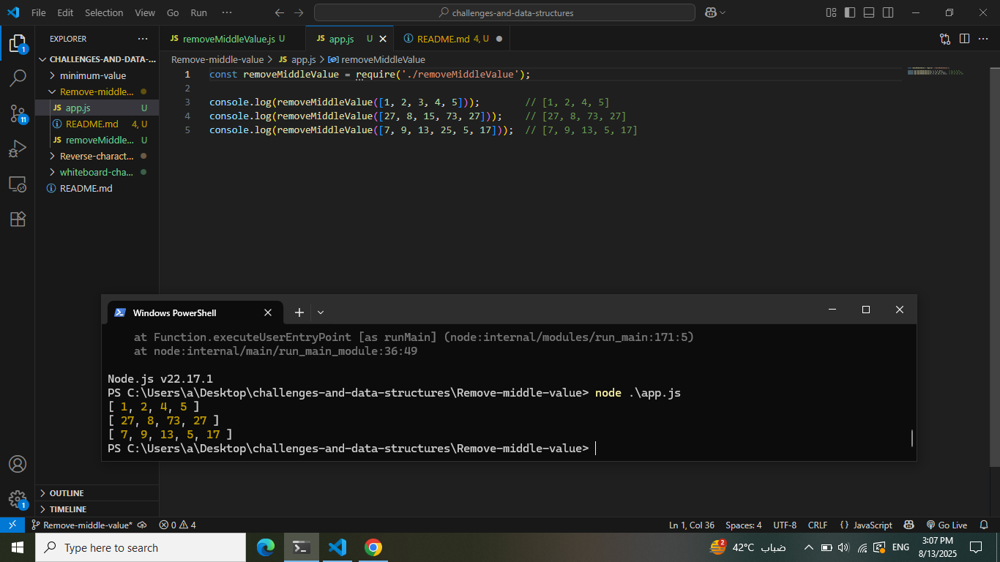

# challenges-and-data-structures

## whiteborard images

### challenge 1/ A:Array Reversal

*

### challenge B:Most frequent number

### Whitebord Images

challenge 2: Minimum Value

### Challenge 03: Reverse Characters

* [Link-to-Challenge-3](./Reverse-characters/README.md)

### Output Screenshot

### Challenge 04: Rrmove Middle Value

* [Link-to-Challenge-4](./Remove-middle-value/README.md)

### Output-Screenshot

### challenge 05-A:Single  Linked List

* [Link-to-Challenge-5](/Data-Structures/Linked-List/Linked-List-Implementation/README.md)

### challenge 05-B: Reverse Linked List

* [Linked List Reverse](./Data-Structures/Linked-List/Linked-List-Implementation/Reverse/README.md)

### challenge 05-c: Merge-Sorted Linked List

* [Linked List Merge](./Data-Structures/Linked-List/Linked-List-Implementation/MergeSorted/README.md)

### challenge 05-D: Rotate Linked List

* [Linked List Merge](./Data-Structures/Linked-List/Linked-List-Implementation/RotateLinkedList/README.md)

### challenge Stack and Queue

* [Stack and Queue](./Data-Structures/stack-queue/stack-queue-imlementation/README.md)

### challenge Min Stack

* [Min Stack Challenge](./Data-Structures/stack-queue/Min-Stack/README.md)

### challenge Delet Middle Element

* [delet middle element Challenge](./Data-Structures/stack-queue/Delet-Middle-Element/README.md)

### challenge Binary Tree

* [Binary Tree Challenge](./Data-Structures/Trees/TreeImplemention/BinaryTree/README.md)

### challenge Second Max Value

* [Second Max Value Challenge](./Data-Structures/Trees/TreeImplemention/SecondMaxValue/README.md)
